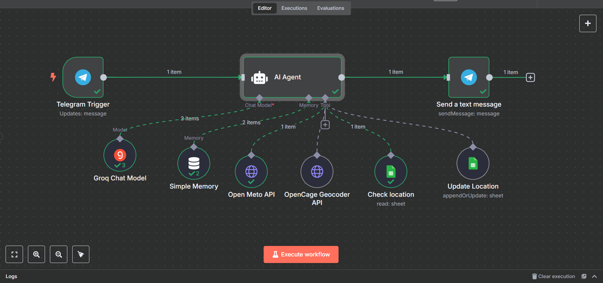

# 🌤️ TenkiBot – Telegram Weather Assistant Powered by n8n

**TenkiBot** is a simple and friendly Telegram bot that gives real-time weather updates based on the user's location. It's built with [n8n](https://n8n.io/) and uses public APIs for geocoding and weather data.

---

## 🚀 Features

- `/start` – Greet the user and show available commands  
- `/setlocation` – Save your city or location  
- `/change` – Update your location anytime  
- `/today` – Get today’s weather forecast  
- `/tomorrow` – Get tomorrow’s forecast  
- `/help` – Show help menu  

---

## ⚙️ Tech Stack

- **n8n** – No-code workflow automation  
- **Telegram Bot API** – For user interaction  
- **Google Sheets** – Store user chat ID, location, and coordinates  
- **OpenCage Geocoder API** – Convert location names to coordinates  
- **Open-Meteo API** – Fetch real-time weather data  
- **Qrok Chat Model** – Generate friendly AI responses

---

## 🛠️ How It Works

1. User sends `/setlocation` or `/change` with a city/place name.
2. n8n:
   - Uses **OpenCage API** to get latitude and longitude.
   - Stores or updates user data in **Google Sheets**.
3. On `/today` or `/tomorrow`:
   - n8n checks for the saved location.
   - Uses **Open-Meteo API** to fetch forecast data.
4. Optionally, **Qrok** chat model is used to format human-like replies.

---

## 🧪 Workflow

---

## 📝 To-Do / Improvements

- Add push-based daily weather reports  
- Allow setting timezones or preferred units  
- Add support for multiple languages  
- Use a real DB like Firebase or Supabase for scaling

---

## 🤝 Contributing

Pull requests and suggestions are welcome! If you'd like to collaborate or improve TenkiBot, feel free to fork and open a PR.

---

## 📬 Contact

If you have questions or want to build something similar,  
**DM me on [LinkedIn](https://www.linkedin.com/in/mareeswaranc)** or open an issue here!

---

## 📄 License

MIT License
